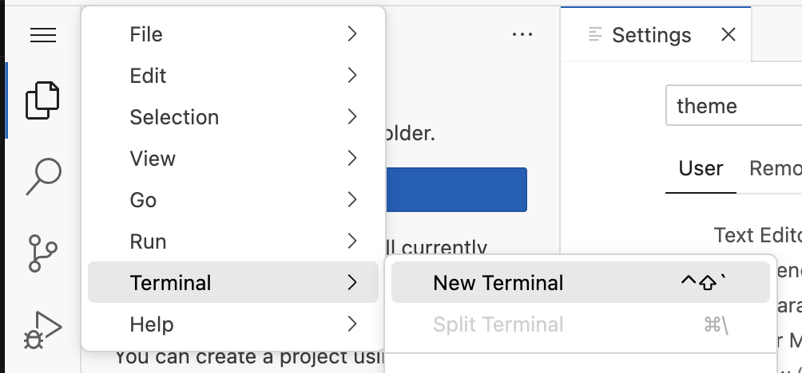
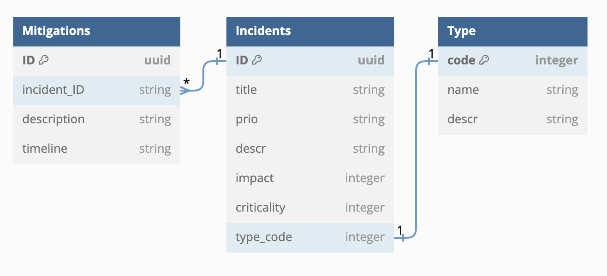
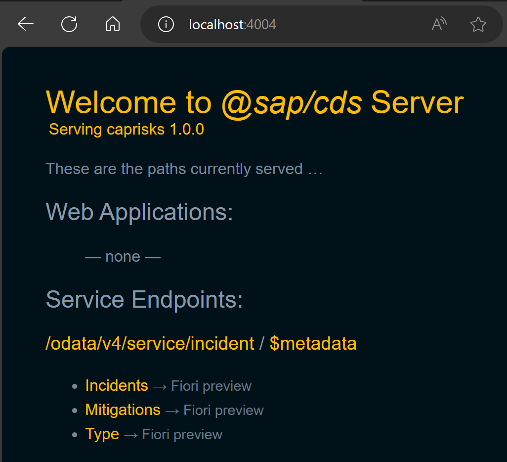
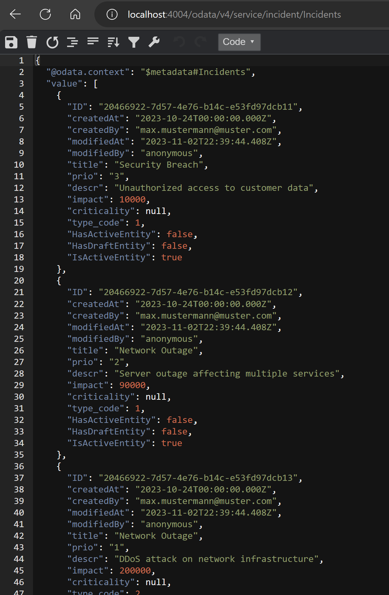

# Create a CAP-Based Application :computer:
This tutorial shows you how to create a new CAP-based application, which exposes the OData V4 protocol.
You will learn
- How to use the CAP’s tooling cds init to create your project
- How to use the CAP’s tooling cds watch to launch your project
- How to add files to your project

The full code base of the CAP app can be found [here](./caprisks/) should you need to check or copy the code. 

In addition, the CAP documentation is actually pretty solid! It has its own [website here](https://cap.cloud.sap/docs/get-started/jumpstart)


## Part 1 - Create and initialize the project
If you're working BAS, make sure you have created a Dev Space based on the Full Stack Cloud Application option, otherwise you might be missing some tooling required for CAP.

### 1. Open a command line window. In BAS it's here in the hamburger menu:



For VSCode, the same Terminal menu is just at the top. 

### 2. Create a new directory for your application.
```bash
mkdir caprisks
```

### 3. Switch to your project root folder. Now you'll definitly need the terminal:
```bash
cd caprisks
```

### 4. Create an initial CAP project by executing using the CAP command line tool.
```bash
cds init
```


### For VSCode users
If you're using VSCode, you can open a new IDE with your new project as the root folder like so:
```bash
code .
```


Also in VS Code choose Terminal → New Terminal from its menu. A new terminal opens in the lower right part of the VS Code screen.

### 5. Terminal, run the following command.
This installs all the dependencies for the project.  You can find these listed in the ```package.json``` file. Dependencies are installed in a folder called `node_modules`. 
```bash
npm install
```


### 6. In the VS Code terminal, start a CAP server.
```bash
cds watch
```
The CAP server serves all the CAP sources from your project. It also “watches” all the files in your projects and conveniently restarts whenever you save a file. Changes you have made will immediately be served without you having to do anything

The screen now looks like this:


The CAP server tells you that there is no model and no service definitions yet that it can serve. You add some in the next step.

## Part 2 - Adding tables and services to the project
Ensure you've opened your project in folder view to see all it's components. In BAS this can be done via Explorer (Ctrl-Shft-E) and Open Folder. Open the folder ``/home/user/caprisks/``. 

### 1. Create the database tables
Create a new file in the ``db`` folder called ``schema.cds``

The schema we will be working with looks as follows:



In CAP, there are two ways of modelling relations between entities: [`Compositions` and `Associations`](https://cap.cloud.sap/docs/guides/domain-modeling#associations). These are built-in features that manage foreign keys. 

A **Composition** is used when you want to imply ownership of one entity to another. In our data model above, we can say that all Mitigations belong to an Incident, in the same way for instance that
a sales order line item can not exist outside of the sales order header. 

An **Association** is for a "has a" type relationship. In this case, our incidents have an incident type, but incident types exist perfectly happy all by themselves so we say that the Incident has a Type. 
This in contrast to: A type belongs to an Incident and cannot live without it. 

Knowing this, we can model the following, and we're adding that we created. You can copy and paste it into the file, or you can of course have a go yourself first.

To follow along, the first thing we need in our `schema.cds` is a namespace:

```js
namespace sap.ui.riskmanagement;
```

Next we'll import some aspects and models from the standard CDS libraries. For instance the aspect `managed` will add the usual suspects of `createdBy, createdAt, modifiedBy, modifiedAt` and keeps them in sync when doing database inserts or updates.

```js
using {
  managed,
  cuid,
  sap.common.CodeList
} from '@sap/cds/common';
```

For this app, we're modelling three entities as highlighted in the data model above. `Incidents` is the 'main' entity and looks like this, taking into account one Composition to a 
number of Mitigations, and an association to the incident Type.

```js
entity Incidents : cuid, managed {
  title       : String(100);
  prio        : String(5);
  descr       : String;
  mitigations : Composition of many Mitigations
                  on mitigations.incident = $self;
  impact      : Integer;
  criticality : Integer;
  type        : Association to Type;
}
```

Mitigations hold the table of possible solutions for an incident

```js
entity Mitigations : cuid, managed {
  description : String;
  timeline    : String;
  incident    : Association to one Incidents;
}
```

Last, type is defined as a `Codelist`, which adds a few standard fields, in addition to some annotations

```js
entity Type : CodeList {
  key code: Integer;
}
```

Each of the entities has a key called `ID` (inherited from the ``cuid`` common type) and several other properties. An ``Incident`` has one ``Mitigations`` and, therefore, it has an association to exactly one `Incident`. Under the hood, a field is added called `incident_ID`. A ``Mitigation`` in turn can be used for one ``Incident``, so it has a “to one” association. The key is automatically filled by the CAP server, which is exposed to the user of the service via the aspect [``cuid``](https://cap.cloud.sap/docs/cds/common#aspect-cuid). 


Notice how the CAP server reacted to saving and creating the file. It now tells you that it has a model but there are no service definitions yet and, thus, it still can’t serve anything. The following will be at the bottom of the console output:

```
No service definitions found in loaded models.
Waiting for some to arrive...
```

Next, you add a service definition.

### 2. Create the OData V4 Service

> Heads up! The links below to `localhost` apply only to VSCode, BAS will generate its own link that'll open as soon as you watch `cds watch` your project

Create a file called ``risk-service.cds`` in the ``srv`` folder.

Copy the code here and paste it into the file. 
```js
using { sap.ui.riskmanagement as my } from '../db/schema';
@path: 'service/incident'
service IncidentsService {
 
  @odata.draft.enabled
  entity Incidents as projection on my.Incidents;
  entity Mitigations as projection on my.Mitigations;
}
```
It creates a new service ``IncidentsService`` in the namespace ``sap.ui.riskmanagement``. This service exposes two entities: `Incidents` and `Mitigations`, which are exposing the entities of the database schema you’ve created in the step before. You'll notice we did not need to add the `Type` entity. This is because we used the `Codelist`, which adds an annotation to auto-expose the entity if it's used.

If you again look at the terminal, you see that the CAP server has noticed the new file and now tells us that it serves something under [http://localhost:4004](http://localhost:4004).

### 3. In your browser open the link [http://localhost:4004](http://localhost:4004), or follow the BAS pop up



### 4. Choose the ``$metadata`` link.

You see the OData metadata document of your new service. So, with just the two files for the database schema and the service exposure you added to your project, you have already got a running OData service! You might wonder why the service itself is called ``incidents`` even though in the file it’s called ``IncidentsService``. This is a convention in CAP, the service suffix is subtracted from the name.

If you now choose the ``Incidents`` link, you only get this:
```js
{
    @odata.context: "$metadata#Incidents",
    value: [ ]
}
```
So, there’s no data yet. This is because so far, your model doesn’t contain any data. You add some now.

### 5. Create a folder called ``data`` in the ``db`` folder of your app. Now download a local copy of all the csv files from this [github repository](./caprisks/db/data/). Copy the files into the newly created ``data`` folder in your project.  

You have now added three comma-separated value (CSV) files that contain local data for ``Incidents``, ``Mitigations`` and ``Type``  entities. A quick look into the ``sap.ui.riskmanagement-Incidents.csv`` (the name consists of your namespace and the name of your database entity from the schema.cds file) file shows data like this:

```csv
ID;createdAt;createdBy;title;prio;descr;impact;type_code
20466922-7d57-4e76-b14c-e53fd97dcb11;2023-10-24;max.mustermann@muster.com;Security Breach;3;Unauthorized access to customer data;10000;1
...
```

The first line contains all the properties from your ``Incidents`` entity. While most of the fields ones are straight forward, consider the ``type_code`` property. In your entity, you only have a ``type`` property, so where does it come from? ``type_code`` is an association to ``Type``, as ``Incidents``, CAP creates a foreign key itself that follows the naming convention ``<AssociationProperty>_<AssociatedEntityKey>`. Once deployed you'll find these fields in your actual database. This *can* be a little confusing because sometimes in the annotations you refer to this key directly.

To learn more about composition and associations, check out the [CAP help](https://cap.cloud.sap/docs/cds/cdl#associations)

Once again, the CAP server has noticed the changes you've made and will reload as soon as you save or add these files. 

There are example CSV files in the app provided in this repository if you're looking for some assistance.

### 6. Revisit the ``Incidents`` entity [http://localhost:4004/odata/v4/service/incident/Incidents](http://localhost:4004/odata/v4/service/incident/Incidents) in your browser. You now see the data exposed.



When you revisit the ``Incidents`` entity, you might see something simlar but not this nicely-formatted JSON output above. This doesn’t mean you have made a mistake in the tutorial. Rather, this is just a formatted output.  There are various chrome/edge extensions to install that will do this for you. 

And that’s it. You now have a full blown OData service, which complies with the OData standard and supports the respective queries without having to code anything but the data model and exposing the service itself. 
