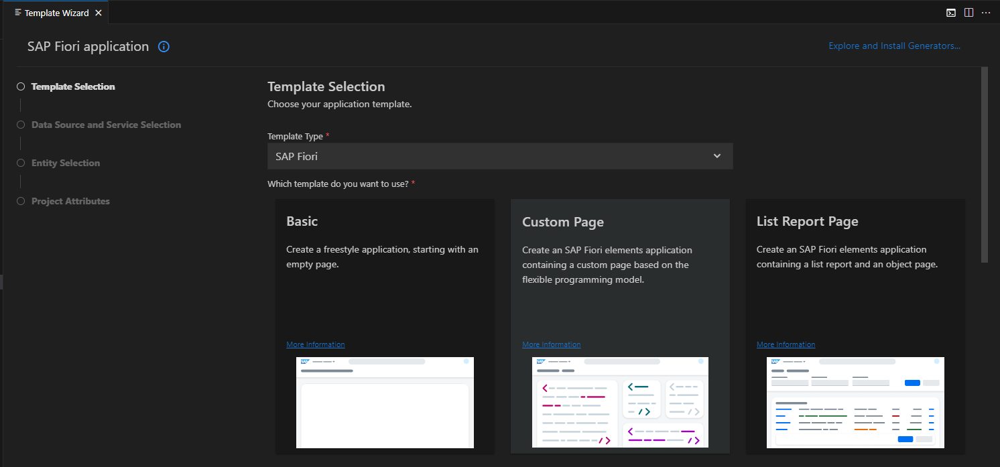
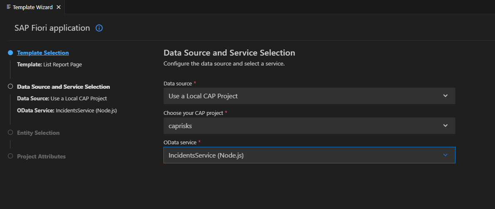
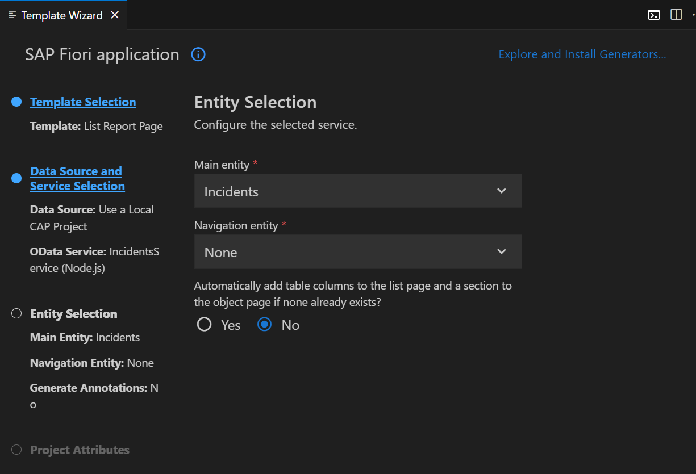
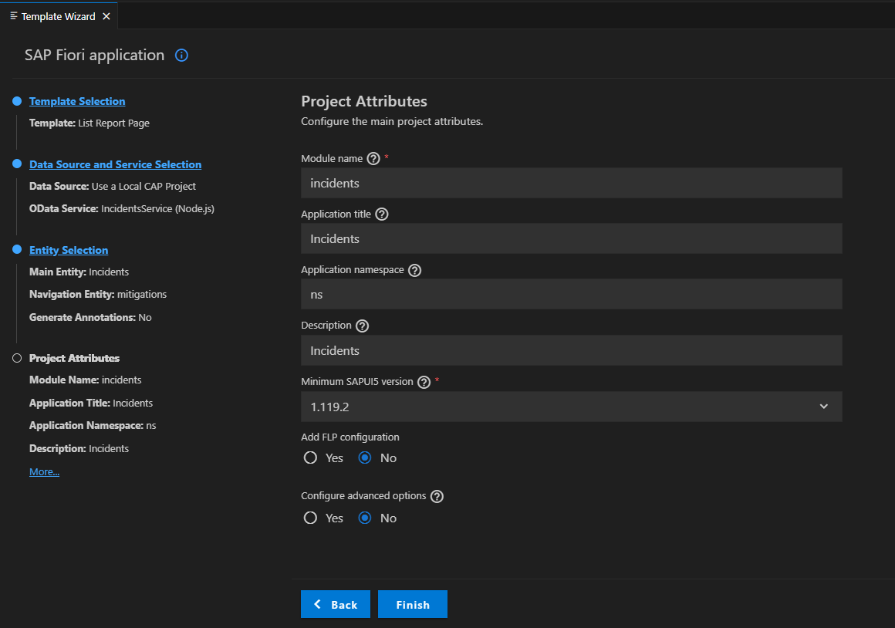
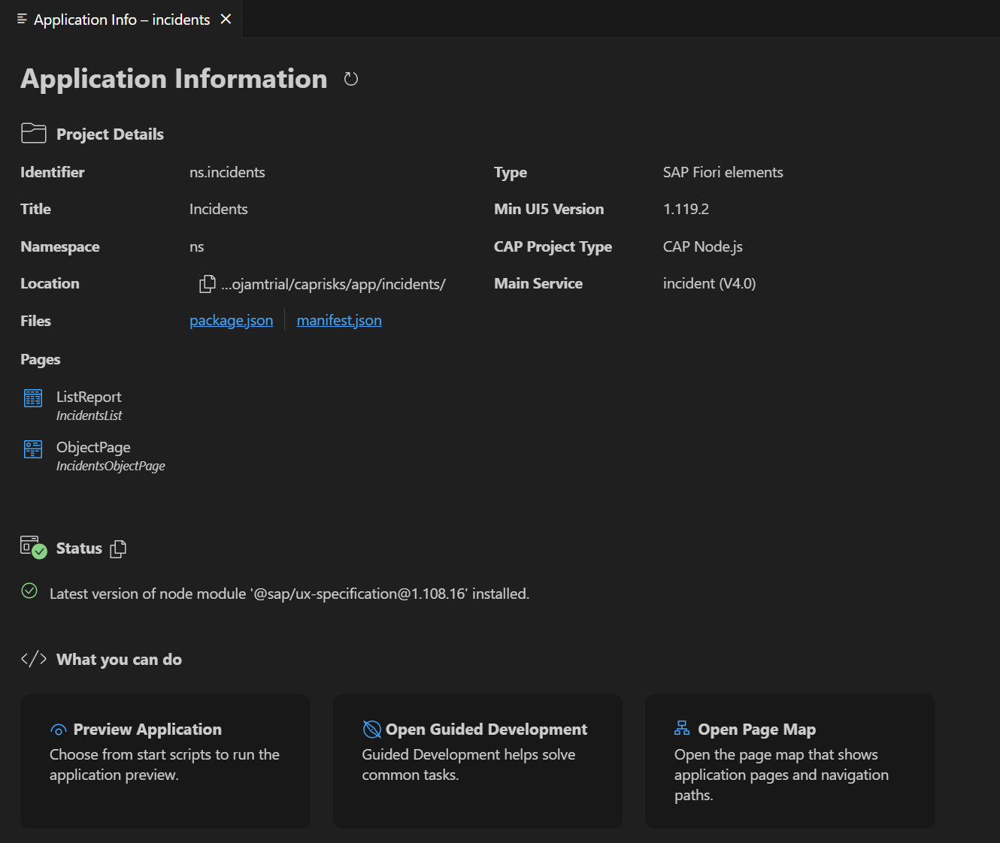
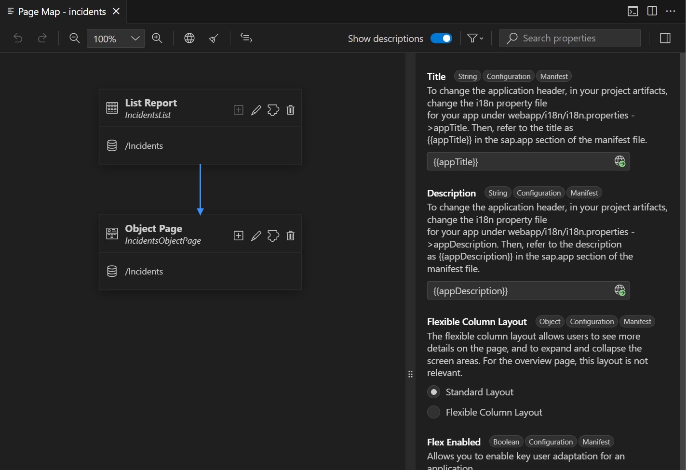
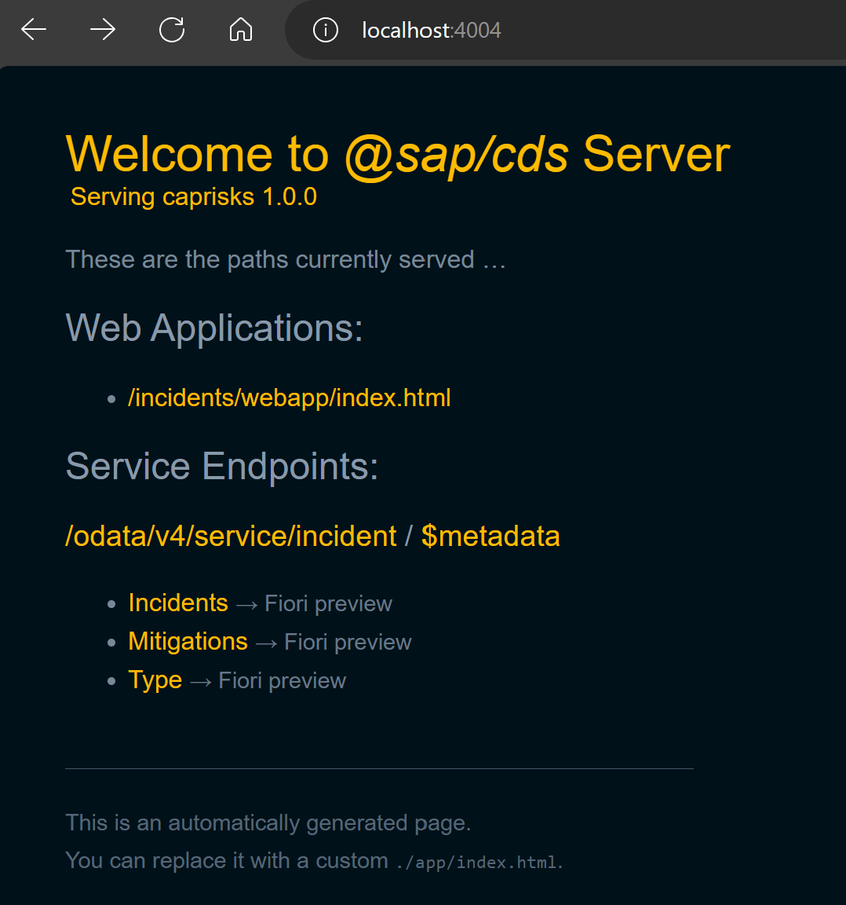
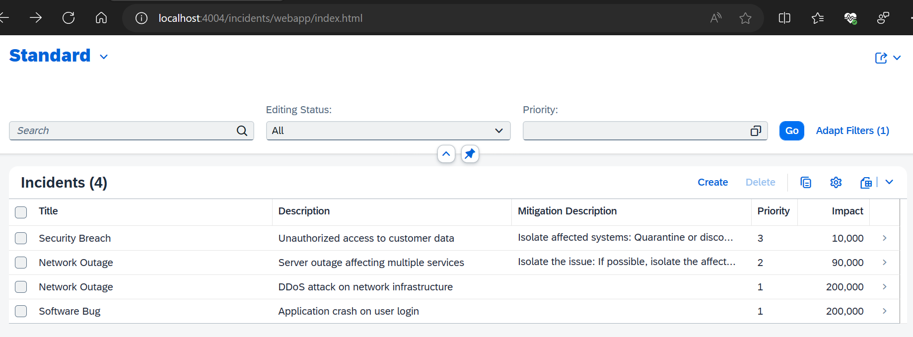
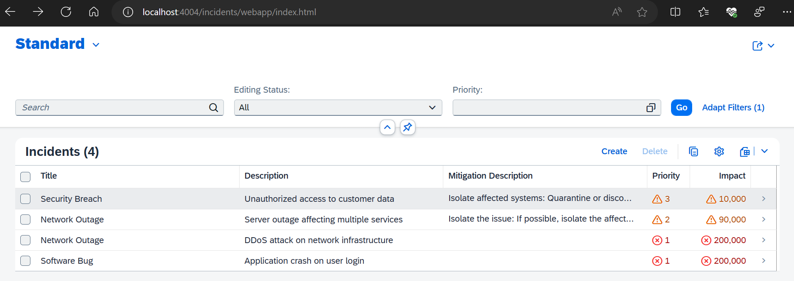

# Create an SAP Fiori Elements UI :hibiscus:
This tutorial shows you how to create an SAP Fiori elements app on top of your previously created CAP service.

You will learn:
- How to create an SAP Fiori elements app on top of your previously created CAP application
- How to modify the UI with OData annotations
- How to check the annotation files
- How to add custom code to your application

**You must have completed the previous tutorial before starting this one**

## Overview
An SAP Fiori elements app is an application that leverages SAPUI5, SAPUI5 controls, and SAPUI5 model view controller (MVC) concepts. In a plain SAPUI5 or a freestyle SAPUI5 app, all the views and controllers are part of your project. In contrast, in an SAP Fiori elements app most of the code is outside of the project, managed centrally by the SAP Fiori elements team. The code inside your project only references these central components. They take care of creating the UI according to the latest SAP Fiori design guidelines and cover all the controller logic for you out of the box. The UI can be influenced by OData annotations. They determine, for example, which properties of an OData service make up the columns of a table that displays the content of the service.

## Part 1 - Generate the UI with an SAP Fiori elements template

To generate a UI, we use the Fiori tooling. 

### 1. Invoke the Command Palette ( View → Command Palette or Shift + Command + P for macOS / Ctrl + Shift + P for Windows) and choose Fiori: Open Application Generator.

### 2. Choose template type **SAP Fiori** and template **List Report Page**.



### 3. Choose Next.

### 4. In the next dialog, choose ``Use a Local CAP Project`` and choose your current ``caprisks`` project.



### 5. Select ``Incidents`` as the main entity, choose the option **No** to avoid adding table columns automatically. Choose **Next**.



### 6. Enter ``incidents`` as the module name and ``Incidents`` as the application title.

### 7. Enter ``ns`` as the namespace and ``Incidents`` as the description for the application 

### 8. Leave the default values for all other settings.

### 9. Choose **Finish** to generate the application.



### 10. On completion the **Application Info** should open 



The application is now generated and in a few seconds you can see it in the ``app`` folder of your project. It contains a ``incidents`` and a ``webapp`` folder with a ``Component.js`` file that is characteristic for an SAPUI5 app.

*However, the code in the App is minimal and it basically inherits its logic from the ``sap/fe/core/AppComponent``. The ``sap/fe/core/AppComponent`` is the base class for SAP Fiori elements. This class is managed centrally by SAP Fiori elements, so you don’t need to modify it yourself.*


View the page map by selecting  ``Open Page Map`` to see a view of the application pages.  



**If you find the page map is not loading run the following command in the root directory of the web application (i.e. caprisks/app/incidents) to add this as a dev dependency for your project to work**
```
npm i @sap/ux-specification --save-dev
```

## Part 2 - Modify the UI with OData annotations

### 1. If it is not still running from the previous tutorial, execute ``cds watch`` in a VS Code terminal and switch to [http://localhost:4004](http://localhost:4004) in your browser.

You can now see that the CAP server has discovered an HTML page in your ``app`` folder:



### 2. Choose the link [http://localhost:4004/incidents/webapp/index.html](http://localhost:4004/incidents/webapp/index.html) for the HTML page.

### 3. You can now see the application without any data


There are no visible columns because the application is currently missing UI annotations. You add them in the next step

### 4. Add some annotations to change the UI.

You'll find that the Fiori Elements Generator created a file called `annotations.cds` in the `app/incidents` folder. This is where the Page Map sticks annotations, and where you can 
add your own by hand. You can use the Page Map to add columns, fields, sections etc to your list and object page and it's worth experimenting with this.

Annotations can be a bit confusing though so if you're stuck, here are the annotations that our sample is using:

```js
using IncidentsService as service from '../../srv/risk-service';

annotate IncidentsService.Incidents with {
    title  @title: 'Title';
    prio   @title: 'Priority';
    descr  @title: 'Description';
    impact @title: 'Impact';
}

annotate IncidentsService.Mitigations with {
    ID            @(
        UI.Hidden,
        Common: {Text: description}
    );
    description   @title: 'Description';
    timeline      @title: 'Timeline';
}

annotate IncidentsService.Incidents with @(UI: {
    HeaderInfo             : {
        TypeName      : 'Incident',
        TypeNamePlural: 'Incidents',
        Title         : {
            $Type: 'UI.DataField',
            Value: title
        },
        Description   : {
            $Type: 'UI.DataField',
            Value: descr
        },
        TypeImageUrl  : 'sap-icon://alert'
    },
    SelectionFields        : [prio],
    LineItem               : [
        {Value: title},
        {Value: descr},
        {
            Value: mitigations.description,
            Label: 'Mitigation Description'
        },
        {
            Value      : prio,
            Criticality: criticality
        },
        {
            Value      : impact,
            Criticality: criticality
        }
    ],
    Facets                 : [
        {
            $Type : 'UI.ReferenceFacet',
            Label : 'Main',
            Target: '@UI.FieldGroup#Main',
        },
        {
            $Type : 'UI.ReferenceFacet',
            Label : 'Mitigations',
            ID    : 'Mitigations',
            Target: 'mitigations/@UI.LineItem#Mitigations',
        },
    ],
    FieldGroup #Main       : {Data: [
        {Value: prio, },
        {Value: impact, },
        {Value: descr, },
        {Value: type_code }
    ]},


    FieldGroup #Mitigation1: {
        $Type: 'UI.FieldGroupType',
        Data : [
            {
                $Type: 'UI.DataField',
                Value: mitigations.description,
            },
            {
                $Type: 'UI.DataField',
                Value: mitigations.timeline,
            },
        ],
    }

}, ) {
    type @title: 'Type' 
    @(Common : {
        Text            : type.name,
        TextArrangement : #TextOnly,
        ValueListWithFixedValues: true,
        ValueList       : {
            Label          : '{i18n>criticality}',
            CollectionPath : 'Type',
            Parameters     : [
                {
                    $Type               : 'Common.ValueListParameterInOut',
                    ValueListProperty   : 'code',
                    LocalDataProperty   : type_code
                }
                
            ]
        }
    });
    type_code @title: 'Type' 
      @(Common : {
        Text            : type.name,
        TextArrangement : #TextOnly,
        ValueListWithFixedValues: true,
    });
};

annotate IncidentsService.Mitigations with @(UI.LineItem #Mitigations: [
    {
        $Type: 'UI.DataField',
        Value: description,
    },
    {
        $Type: 'UI.DataField',
        Value: timeline,
    },
]);

annotate IncidentsService.Type with {
    code @title: 'Type'
      @(Common : {
        Text            : name,
        TextArrangement : #TextOnly
    });
    name @title: 'Name';
}
```

As in the steps before, the CAP server has noticed the new file and compiled the service again, so now it contains the additional annotations.

### 5. In your browser, reload the page of the empty SAP Fiori elements app.

### 6. Choose **Go**

It now shows a work list with some columns and the data from the service.




## Part 3 - Add Business Logic to Your Application

### 1. Add a service implementation to place your hooks

Every service has a series of hooks: `on`, `before` or `after` events such as `create` or `update`, in addition to implementing actions and functions. By default, the implementation 
of this is a a javascript file name the same as your service. So, please create a file ``risk-service.js`` in the ``srv`` folder of your app. 

Copy the code below into the file you just created. This bit of code is going to dynamically add the criticality of the incident based on the impact. 

```js

/**
 * Implementation for Risk Management service defined in ./risk-service.cds
 */
module.exports = async (srv) => {
    srv.after('READ', 'Incidents', risksData => {
        const risks = Array.isArray(risksData) ? risksData : [risksData];
        risks.forEach(risk => {
            if (risk.impact >= 100000) {
                risk.criticality = 1;
            } else {
                risk.criticality = 2;
            }
        });
    });

};
```

In your browser, your Fiori Elements app will reload and reflect these changes. 

It now shows our work list with the columns ``Priority`` and ``Impact`` with color and an icon, depending on the amount in Impact.



### Explanation
Because your file is called ``risk-service.js`` and, therefore, has the same name as your application definition file ``risk-service.cds``, CAP automatically treats it as a handler file for the application defined in there. CAP exposes several events and you can easily write handlers like the above.

In this case, the event after is triggered after a **READ** was carried out for our ``Incidents`` entity. In your custom handler, you get all the data (in this case, all the risks) that was read according to the query. You can loop over each of them and, if needed, adjust the data of the response. In this case, you change the value of the ``criticality`` when the impact is bigger than 100000. The new values for ``criticality`` are then part of the response to the read request.

So, this affects the application’s response, but how does it translate into a changed UI? For this, you have got to go back to the annotations you created in Create a CAP-Based Application where you find your ``srv/risks-service-ui.cds`` file. There, you had the two columns ``prio`` and ``impact`` annotated with an additional ``Criticality`` annotation. This annotation points to the ``criticality`` property of your application.