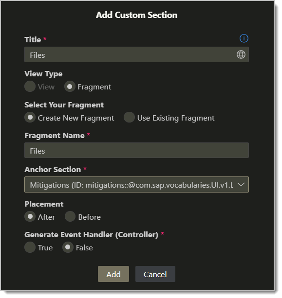
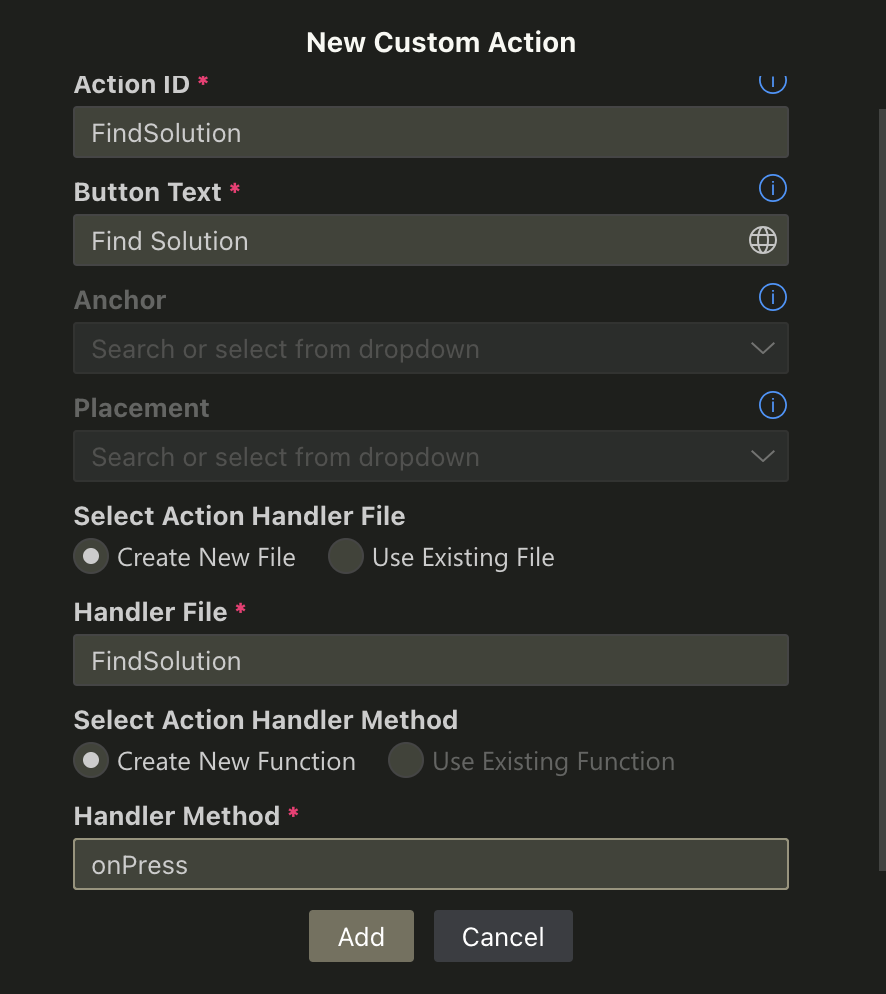

# Extend your Fiori Elements Application to use AWS service

Now, we're going to extend our CAP application from the earlier session to use two AWS services:
1. We'll add a custom fragment to our object page to display and upload a PDF to an S3 bucket
2. We'll add a custom bucket to the object page header to find a solution to our problem via the generative AI service called Amazon Bedrock

To extend Fiori Elements, we will use the Page Map in all examples going forward.

Heads up! Fiori Elements extensions generally get cached! Please open your apps in the browser with the following flag: `/index.html?sap-ui-xx-viewCache=false`

## 1. Add PDF's to our Incident

### Add a function to Incident Service

Find your service file, which should be `/srv/risk-service.cds`. We're going to add a `function`. [Functions and actions](https://cap.cloud.sap/docs/guides/providing-services#actions-functions) go beyond common CRUD operations and add a way to provide something completely custom. The difference between Functions and Actions
is that the former are invoked using `GET`, while the latter add data in the body of the request using `POST`. 

Our type is a complex type that represents a file in the S3 bucket we will be using:

```js
  type Item {
    Name          : String;
    LastModified  : String;
    ETag          : String;
    Size          : String;
    Owner         : {
      ID          : String;
      DisplayName : String;
    };
    StorageClass  : String;
    FileLocation  : String;
  }
```

This type needs to be placed inside the service definition itself. As you can see a type does not need a `key` field, and this one uses a nested object to represent the `Owner` of the file. Because we need to return it as an array from our function, our function definition looks like this. 

```js
function FileList()              returns array of Item; 
```

Note that it actually has brackets. Its invocation on the service side reflects this, so if you want to see results from this function try it in your browser like so: `/odata/v4/service/incident/FileList()`. To use it in a UI5 binding, also use it as `items={/FileList()}` there, too. 


That's it. For completeness sake, the full code is:

<details>

```js
using {sap.ui.riskmanagement as my} from '../db/schema';

@path: 'service/incident'
service IncidentsService {

  @odata.draft.enabled
  entity Incidents   as projection on my.Incidents;

  entity Mitigations as projection on my.Mitigations;

  //This is a custom type, which is necessary to return a list of files since we have no 
  //Database entities we can refer to for this purpose
  type Item {
    Name          : String;
    LastModified  : String;
    ETag          : String;
    Size          : String;
    Owner         : {
      ID          : String;
      DisplayName : String;
    };
    StorageClass  : String;
    FileLocation  : String;
  }
  
  // returns a list of files uing the AWS S3 bucket objects
  function FileList()              returns array of Item; 
}
```
</details>

### Add the function implementation

Now that we have a function added to our service, it's time to provide an implementation for it. As opposed to a view or a projection on an entity or view, this function will return nothing or even complain about the lack of implementation and we need to provide code. In this case, we want to read our S3 bucket. 

This section uses a plugin for NodeJS called `xml2json`, which simplifies working with XML payloads. To add and use a plugin to the node application, we have to stop our `cds watch` process, install the plugin, and start the watcher. To stop `cds watch`, make sure the terminal is selected and press `CTRL C`, or simply close and reopen. 

Install the plugin by typing:

```sh
npm install xml2json
```

After a few seconds this will be completed, meaning code has been added to the `node_modules` folder, and the dependency is listed in `package.json`. Then we can start watching our project again using 

```sh
cds watch
```

Now for the actual Implementation. First, to provide a handler for your function, we need to add something to `srv/risk-service.js`. So, underneath our `READ` implementation that adds the criticality, we will place a second implementation. Before we do that, we need to define two things at the very top of the file. We included our test URL, but you need to replace this with your own API endpoint to READ the S3 Bucket. 

```js
// top of the file
const parser = require("xml2json");
const url = "https://2jm9jcmsc5.execute-api.us-east-1.amazonaws.com/v1/appgyver-1/";
```

> Note that this is now referencing an additional npm package, so in case this is not installed yet in your local setup it may raise an error can be fixed with `npm i xml2json` or by adding the information on file `package.json`

```js
// second handler, to be placed after the READ on Incidents
srv.on("FileList", async () => {
  try {
    //our implementation goes in here


    //we return an array of our Item type, defined in the service
    return []
  } catch(e) {
    console.error("Error:", error);
    throw error; // Re-throw the error for better error handling up the chain    
  }
});
```

The first step is to read the contents of the Bucket:

```js
const response = await fetch(url);
if (!response.ok) {
  throw new Error(`HTTP Error: ${response.status} - ${response.statusText}`);
}
```

The next step is to convert the returned XML to JSON:

```js
const result = await response.text();
const data = parser.toJson(result);
const filesJson = JSON.parse(data);
```

Last, we check the resulting JSON and then convert that JSON to our `Items` type:

```js
if (filesJson?.ListBucketResult?.Contents) {
  const files = filesJson.ListBucketResult.Contents.map((file) => {
    file.FileLocation = url + file.Key;
    return file;
  }).filter((file) => {
    if (file.Key.endsWith(".pdf")) {
      return file;
    }
  });
  return files.map((f) => ({ Name: f.Key, ...f }));
} else {
  throw new Error("Invalid response data structure");
}
```


Again to be complete, here is the full implementation of the FileList handler:

<details>

```js
// second handler, to be placed after the READ on Incidents
srv.on("FileList", async () => {
  try {
    const response = await fetch(url);
    if (!response.ok) {
      throw new Error(`HTTP Error: ${response.status} - ${response.statusText}`);
    }

    const result = await response.text();
    const data = parser.toJson(result);
    const filesJson = JSON.parse(data);

    if (filesJson?.ListBucketResult?.Contents) {
      const files = filesJson.ListBucketResult.Contents.map((file) => {
        file.FileLocation = url + file.Key;
        return file;
      }).filter((file) => {
        if (file.Key.endsWith(".pdf")) {
          return file;
        }
      });
      return files.map((f) => ({ Name: f.Key, ...f }));
    } else {
      throw new Error("Invalid response data structure");
    }
  } catch (error) {
    console.error("Error:", error);
    throw error; // Re-throw the error for better error handling up the chain
  }
});
```
</details>

### Add a custom section to the UI using the Page Map
You may need to re-open your SAP Fiori Application at this point to use the GUI to add a section. In BAS, click on "SAP Fiori" icon in the sidebar and expand the folder path ```caprisks\incidents\Pages\``` and then click on ```IncidentsObjectPage```.

To add an extension to the body of a Fiori Elements app, choose the edit function on the Object Page and choose to add a new section


From there, choose to add a new section with a new Fragment and a new implementation, following the Mitigations section. You can give it any name you like, we're calling ours `Files`:



This results in


There are two things to implement here. You'll see a fragment and a handler. 

Inside the fragment we'll keep things straight forwarded. Things of note in the code below are:

`core:require="{ handler: 'ns/incidents/ext/fragment/Files'}"` on several controls. This is done to make the control aware of a custom handler. 

The binding for the file list is our function above, and you can see it actually uses the brackets: `path: '/FileList()`. This can be a bit of a gotcha. 

```xml
<core:FragmentDefinition xmlns:w="sap.ui.webc.main" xmlns:core="sap.ui.core" xmlns="sap.m"
	xmlns:macros="sap.fe.macros">
	<VBox>
		<HBox>
			<w:FileUploader placeholder="Upload file..."
				core:require="{ handler: 'ns/incidents/ext/fragment/Files'}" change="handler.handleChange"></w:FileUploader>
			<Button
				text="Upload File"
				core:require="{ handler: 'ns/incidents/ext/fragment/Files'}"
				press="handler.handleUploadPress" />
		</HBox>
		<List
			id="list"
			enableBusyIndicator="true"
			headerText="List from AWS"
			growing="true"
			items="{
				path: '/FileList()'
			}">
			<ObjectListItem
				title="{Name}"
				type="Active"
				core:require="{ handler: 'ns/incidents/ext/fragment/Files'}"
				press="handler.onListItemPress"
				number="{= Math.round(${Size} / 1024) } KB" />
		</List>
	</VBox>
</core:FragmentDefinition>
```

And we have our handlers. Don't forgot to change the URL here to your own. This is the AWS API Gateway endpoint that `PUT`'s a file in the S3 Bucket. 

```js
/* eslint-disable no-undef */
sap.ui.define(["sap/m/MessageToast"], function (MessageToast) {
  "use strict";
  let file;

  const url = 'https://2jm9jcmsc5.execute-api.us-east-1.amazonaws.com/v2/appgyver-1'
  return {
    handleUploadPress: async function () {
      if (file) {
        try {

          //creating the data and headers for all call
          const headers = new Headers();
          headers.append("Content-Type", file.type);
          
          const body = new FormData();
          body.append("file", file, file.name);
          body.append("name", file.name);
          
          //this calls the AWS API Gateway endpoint
          await fetch(`${url}/${file.name}`, {
            method: 'PUT',
            headers,
            body
          });

          //refresh the list so our new file shows up in the list
          this.byId('fe::CustomSubSection::Files--list').getBinding('items').refresh()
          MessageToast.show("File uploaded successfully")
        } catch(e) {
          MessageToast.show("Error! File not uploaded");
        }

        file = null;
      }
    },
    handleChange: function (oEvent) {
      //storing the file in a variable so we can use it later
      file = oEvent.getParameter("files")[0];
    },

    onListItemPress: function (oEvent) {
      const { FileLocation } = oEvent.getSource().getBindingContext().getObject();
      window.open(FileLocation, "_blank");
    }
  };
});
```

## 2. Use generative AI to find a solution

Bedrock is an AWS service that allows the developer to easily add a generative AI solution to a problem. In this case we'll use it to try and add a solution to an incident. 

### Add a custom button to the Object Page


Specifing the creation of a new file for the hanlder:



When prompted, call it `FindSolution`. A new file will pop up in the `ext/controller` path of your app and it will implement the `onPress` method that you find on regular old buttons. This is the default:

```js
sap.ui.define([
    "sap/m/MessageToast"
], function(MessageToast) {
    'use strict';

    return {
        onPress: function(oEvent) {
            MessageToast.show("Custom handler invoked.");
        }
    };
});
```

If you now go to an incident in your application you'll find a button at the top, near the Edit option, called Find Solution. 


If you press your shiny new button, you will indeed see the Message Toast pop up saying that the custom handler is invoked. However we don't want a message toast, we want a Dialog outlining a possible solution to our problem, so we're going to replace the `onPress` method to call the Bedrock via AWS API Gateway.

The order of events is:
1. set the screen to busy
2. build the body and header to do the fetch
3. clean up the results
4. create and open a dialog with formatted text and open it to show the user
5. set the screen to no longer busy

To do the fetch more efficiently, we'll convert the function to be `async`. That means we don't need to worry about `.then` and `.catch` promise handlers. 

```js
onPress: async function (oEvent) {
  try {
    // the rest goes in here
  } catch (e) {
    console.log(e);
  }
},
```

Setting the screen to busy is straight forward:

```js
this._view.setBusy(true);
```

Then do the actual call to AWS. In this case, use the url provided below:

```js
//creating the data and headers for all call
const title = oEvent.getProperty("title"); //could be 'descr' too if you prefer

const headers = new Headers();
headers.append("Content-Type", "application/json");

const body = JSON.stringify({
  Question: title,
});

//this calls the AWS API Gateway endpoint
const response = await fetch("https://w2n1b8qko7.execute-api.us-east-1.amazonaws.com/v2/fix", {
  method: "POST",
  headers,
  body,
  redirect: "follow",
});
```

If we did it right, there should be no CORS issues! Now, to get the response, we'll extract the body of the response as text, and then do some regex magic on it:


```js
// this nugget of regex is to remove the quotes from the response and to convert the \n to <br/>
const htmlText = (await response.text()).replace(/\\n/g, "<br/>").replace(/^"[\s]*|\s*"$/gi, "");
```

The response is wrapped in quotes so we'll ditch those, and you'll also see the `\n` linebreak. SAPUI5's `FormattedText` takes HTML so we'll simply replace those to `<br/>`s. Then we open a dialog to show the results to the user. We'll use the `Dialog`, the `Button` and the `FormattedText` so please update the module definition:

```js
sap.ui.define(["sap/m/Button", "sap/m/Dialog", "sap/m/FormattedText"], function (Button, Dialog, FormattedText)
```

And then instantiate!

```js
//construct and open a dialog
const dialog = new Dialog({
  title: "Solution",
  contentWidth: "760px",
  content: new FormattedText({ htmlText }),
  beginButton: new Button({
    text: "Close",
    press: function () {
      dialog.close();
    },
  }),
  afterClose: function () {
    dialog.destroy();
  },
});
```

To polish things off, we'll set the screen to not busy, add some classes to our dialog to make it responsive, and open it!

```js
//to make the dialog responsive
dialog.addStyleClass("sapUiResponsivePadding--content sapUiResponsivePadding--header sapUiResponsivePadding--footer sapUiResponsivePadding--subHeader");
this._view.setBusy(false);
dialog.open();
```

The full handler looks like this

<details>

```js
/* eslint-disable no-undef */
sap.ui.define(["sap/m/Button", "sap/m/Dialog", "sap/m/FormattedText"], function (Button, Dialog, FormattedText) {
  "use strict";

  return {
    onPress: async function (oEvent) {
      try {
        this._view.setBusy(true);

        //creating the data and headers for all call
        const title = oEvent.getProperty("title"); //could be 'descr' too if you prefer

        const headers = new Headers();
        headers.append("Content-Type", "application/json");

        const body = JSON.stringify({
          Question: title,
        });

        //this calls the AWS API Gateway endpoint
        const response = await fetch("https://w2n1b8qko7.execute-api.us-east-1.amazonaws.com/v2/fix", {
          method: "POST",
          headers,
          body,
          redirect: "follow",
        });

        // this nugget of regex is to remove the quotes from the response and to convert the \n to <br/>
        const htmlText = (await response.text()).replace(/\\n/g, "<br/>").replace(/^"[\s]*|\s*"$/gi, "");

        //construct and open a dialog
        const dialog = new Dialog({
          title: "Solution",
          contentWidth: "760px",
          content: new FormattedText({ htmlText }),
          beginButton: new Button({
            text: "Close",
            press: function () {
              dialog.close();
            },
          }),
          afterClose: function () {
            dialog.destroy();
          },
        });

        //to make the dialog responsive
        dialog.addStyleClass("sapUiResponsivePadding--content sapUiResponsivePadding--header sapUiResponsivePadding--footer sapUiResponsivePadding--subHeader");
        this._view.setBusy(false);
        dialog.open();
      } catch (e) {
        console.log(e);
      }
    },
  };
});
```

</details>

## DONE!

Congrats for making it to the end!
