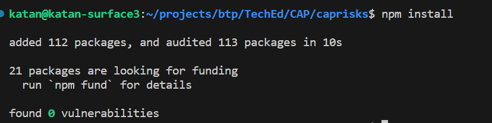
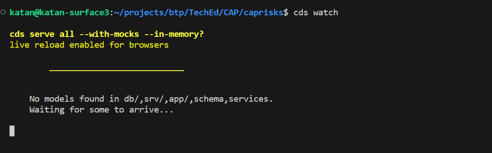

# Create a CAP-Based Application :computer:
This tutorial shows you how to create a new CAP-based application, which exposes the OData V4 protocol.
You will learn
- How to use the CAP’s tooling cds init to create your project
- How to use the CAP’s tooling cds watch to launch your project
- How to add files to your project

The full code base of the app can be found [here](./caprisks/) should you need to check or copy the code


### Step 1 - Create and initialize the project
1. Open a command line window.

2. Create a new directory for your application 
```bash
mkdir caprisks
```

3. Switch to your project root folder.
```bash
cd caprisks
```

4. Create an initial CAP project by executing the command ```cds init```.
```bash
cds init
```


5. Open the project in VS Code.
```bash
code .
```


6. In VS Code choose Terminal → New Terminal from its menu.
A new terminal opens in the lower right part of the VS Code screen.

7. In the VS Code terminal, run the following command.
This installs all the dependencies for the project.  You can find these listed in the ```package.json``` file
```bash
npm install
```


8. In the VS Code terminal, start a CAP server.
```bash
cds watch
```
The CAP server serves all the CAP sources from your project. It also “watches” all the files in your projects and conveniently restarts whenever you save a file. Changes you have made will immediately be served without you having to do anything

The screen now looks like this:



The CAP server tells you that there is no model and no service definitions yet that it can serve. You add some in the next step.

### Step 2 - Add files to the project

1. Create the database tables
Create a new file in the ``db`` folder called ``schema.cds``

Copy the code here and paste it into the file.   

```js
namespace sap.ui.riskmanagement;
using { managed } from '@sap/cds/common';
  entity Risks : managed {
    key ID      : UUID  @(Core.Computed : true);
    title       : String(100);
    prio        : String(5);
    descr       : String;
    miti        : Association to Mitigations;
    impact      : Integer;
    criticality : Integer;
  }
  entity Mitigations : managed {
    key ID       : UUID  @(Core.Computed : true);
    description  : String;
    owner        : String;
    timeline     : String;
    risks        : Association to many Risks on risks.miti = $self;
  }
```
It creates two entities in the namespace ```sap.ui.riskmanagement```: ```Risks``` and ```Mitigations```. Each of them has a key called ```ID``` and several other properties. A Risk has a Mitigation and, therefore, the property miti has an association to exactly one Mitigation. A Mitigation in turn can be used for many Risks, so it has a “to many” association. The key is automatically filled by the CAP server, which is exposed to the user of the service with the annotation @(Core.Computed : true).

Notice how the CAP server reacted to dropping the file. It now tells you that it has a model but there are no service definitions yet and, thus, it still can’t serve anything. Next, you add a service definition.

2. Create the OData V4 Service

Create a file called ``risk-service.cds`` in the ``srv``

Copy the code here and paste it into the file. 
```js
using { sap.ui.riskmanagement as my } from '../db/schema';
@path: 'service/risk'
service RiskService {
  entity Risks as projection on my.Risks;
    annotate Risks with @odata.draft.enabled;
  entity Mitigations as projection on my.Mitigations;
    annotate Mitigations with @odata.draft.enabled;
}
```
It creates a new service ``RiskService`` in the namespace ``sap.ui.riskmanagement``. This service exposes two entities: Risks and Mitigations, which are exposing the entities of the database schema you’ve created in the step before.

If you again look at the terminal, you see that the CAP server has noticed the new file and now tells us that it serves something under [http://localhost:4004](http://localhost:4004).

3. In your browser open the link [http://localhost:4004](http://localhost:4004).


4. Choose the ``$metadata`` link.

You see the OData metadata document of your new service. So, with just the two files for the database schema and the service exposure you added to your project, you have already got a running OData service! You might wonder why the service itself is called ``risk`` even though in the file it’s called ``RiskService``. This is a convention in CAP, the service suffix is subtracted from the name.

If you now choose the ``Risks`` link, you only get this:
```js
{
    @odata.context: "$metadata#Risks",
    value: [ ]
}
```
So, there’s no data yet. This is because so far, your model doesn’t contain any data. You add some now.

1. Create a folder called ``data`` in the ``db`` folder of your app. Now download a local copy of both the csv files from this [github repository](./caprisks/db/data/). Copy the files into the newly created ``data`` folder in your project.  

You have now added two comma-separated value (CSV) files that contain local data for both the ``Risks`` and the ``Mitigations`` entities. A quick look into the ``sap.ui.riskmanagement-Risks.csv`` (the name consists of your namespace and the name of your database entity from the schema.cds file) file shows data like this:

```csv
ID;createdAt;createdBy;title;prio;descr;miti_id;impact
20466922-7d57-4e76-b14c-e53fd97dcb11;2021-04-27;max.mustermann@muster.com;CFR non-compliance;Fred Fish;3;Recent restructuring might violate CFR code 71;20466921-7d57-4e76-b14c-e53fd97dcb11;10000
...
```

The first line contains all the properties from your Risks entity. While the other ones are straight forward, consider the ``miti_id`` property. In your entity, you only have a miti property, so where does it come from? ``miti`` is an association to ``Mitigations``, as ``Mitigations`` could have several key properties, the association on the database needs to point to all of these, therefore the CAP server creates a property ``<AssociationProperty>_<AssociatedEntityKey>`` for each key.

As always, the CAP server has noticed the change.

5. Revisit the ``Risks`` entity [http://localhost:4004/service/risk/Risks](http://localhost:4004/service/risk/Risks) in your browser. You now see the data exposed.


When you revisit the Risks entity, you might see something like this instead of the nicely-formatted output above. This doesn’t mean you have made a mistake in the tutorial. Rather, this is just a formatted output.  There are various chrome/edge extensions to do this for you. 

And that’s it. You now have a full blown OData service, which complies with the OData standard and supports the respective queries without having to code anything but the data model and exposing the service itself.
