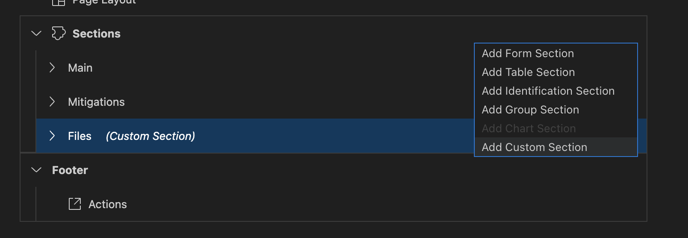

# Extend your Fiori Elements Application to use AWS service

Now, we're going to extend our CAP application from the earlier session to use two AWS services:
1. We'll add a custom fragment to our object page to display and upload a PDF to an S3 bucket
2. We'll add a custom bucket to the object page header to find a solution to our problem via the generative AI service called Bedrock

To extend Fiori Elements, we will use the Page Map in all examples going forward

## 1. Add PDF's to our Incident

### Add a custom section to the UI using the Page Map

To add an extension to the body of a Fiori Elements app, choose the edit function on the Object Page and choose to add a new section



From there, choose to add a new section with a new Fragment and a new implementation, following the Mitigations section. You can give it any name you like, we're calling ours `Files`, which results in


## 2. Use generative AI to find a solution

Bedrock is an AWS service that allows the developer to easily add a generative AI solution to a problem. In this case we'll use it to try and add a solution to an incident. 

### Add a custom button to the Object Page


When prompted, call it `FindSolution`. A new file will pop up in the `ext/controller` path of your app and it will implement the `onPress` method that you find on regular old buttons. This is the default:

```js
sap.ui.define([
    "sap/m/MessageToast"
], function(MessageToast) {
    'use strict';

    return {
        onPress: function(oEvent) {
            MessageToast.show("Custom handler invoked.");
        }
    };
});
```

In this case we're going to replace the `onPress` method with:

```js
//do your thing
```

### Call Bedrock from the custom button


From here, we're going to use this method to call an AWS service and display the results. 

## 2. PDF's to an S3 bucket. 

We're going to allow the user to upload PDF files to an AWS S3 bucket. To accomplish this, we will route reading and writing PDfs through our CAP application and displaying them in Fiori. 

### List the available PDF's

For this exesize we'll add a single Fragment to our Fiori UI to upload a document, and to display a list of available documents. To do this, we once again need the Page Map:


### Create an upload function for a new PDF


### Display the results

