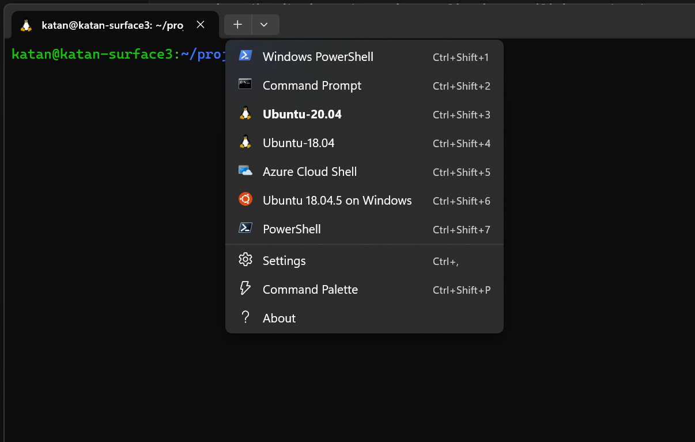
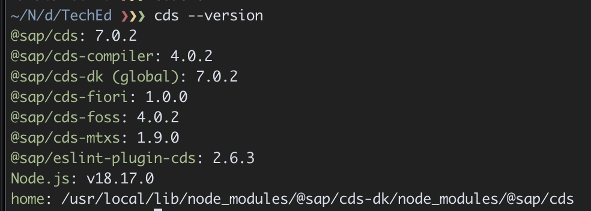

# Environment Setup :wrench:
If you have a BTP account (including BTP Trial), you can use BAS to run this demo and do not require to follow the local environment setup outlined here. 


## Prequisites
### System Requirements
These tutorials are for primarily for Windows & Mac users.  To run the project locally, it is required that the system has at least 16GB RAM and a relatively new processor.  If these cannot be met, we recommend running the tutorial on the SAP Business Application Studio on BTP.

### CLI
This tutorial contains a number of command line snippets that need to be pasted into a command line window (sometimes referred to as command line interface (CLI) or terminal). All snippets listed for macOS/Linux or without platform information can be executed in the ```bash``` or ```zsh```, which are the default shells for these platforms. The Windows snippets are for the Windows Command Prompt and not for the PowerShell. 

#### Windows
Windows users are suggested to use the Git BASH or WSL2 instead. 

#### WSL2 
Alternatively Windows users can setup WSL2, which lets developers access the power of both Windows and Linux at the same time on a Windows machine. It lets developers install a Linux distribution and use Linux applications, utilities, and Bash command-line tools directly on Windows, unmodified, without the overhead of a traditional virtual machine or dualboot setup.  This is amazing for developer productivity. 

To install WSL2. Open PowerShell or Windows Command Prompt in administrator mode by right-clicking and selecting "Run as administrator", enter the ```wsl --install command```, then restart your machine.  By default this will install the Ubuntu Operating System, which is perfect for this tutorial.  You can access the full install guide [here](https://learn.microsoft.com/en-us/windows/wsl/install)

We highly recommend installing the terminal app also, as it supports as many command lines as you would like to install and enables you to open them in multiple tabs or window panes and quickly switch between multiple Linux distributions or other command lines.   The install guide can be found [here](https://learn.microsoft.com/en-us/windows/terminal/get-started)

Start up the terminal app py pressing "start" and then typing "terminal".  By default it will be set to powershell, so hit the "+" button and you should be able to select ubuntu from the drop down.  



So to install apps you would use generally use the ```apt-get``` command in the terminal.   

#### Git Bash
Git Bash is part of the Git for Windows installation and contains the basic UNIX command line tools. In the Git BASH, use the macOS/Linux snippets of the tutorial. VS Code supports the use of the Git BASH for the integrated command line window (called Terminal in VS Code) as well.  

Whilst this is supported, it has not been tested by the team.  

## 1. Visual Studio Code
Visual Studio Code is a free code editor redefined and optimized for building and debugging modern web and cloud applications. 

You can download a copy [here](https://code.visualstudio.com/download), if you have not already installed it for Windows/Mac.

Once installed we recommend installing the following extensions:
- [SAP CDS Language Support](https://marketplace.visualstudio.com/items?itemName=SAPSE.vscode-cds)
- [ESLint](https://marketplace.visualstudio.com/items?itemName=dbaeumer.vscode-eslint)
- [SAP Business Application Studio Toolkit](https://marketplace.visualstudio.com/items?itemName=SAPOSS.app-studio-toolkit)
- [Postman (REST Client)](https://marketplace.visualstudio.com/items?itemName=Postman.postman-for-vscode)
- [Rainbow CSV](https://marketplace.visualstudio.com/items?itemName=mechatroner.rainbow-csv)
- [Fiori Tools Extension Pack](https://marketplace.visualstudio.com/items?itemName=SAPSE.sap-ux-fiori-tools-extension-pack)

To access extensions in VS Code select "View" => "Extensions" from the menu options

### WSL2 Extension Pack
If you are using WSL2, we recommend installing the remote desktop extension pack as described [here](https://learn.microsoft.com/en-us/windows/wsl/tutorials/wsl-vscode#install-vs-code-and-the-wsl-extension)

This extension pack includes the WSL extension, in addition to the Remote - SSH, and Dev Containers extensions, enabling you to open any folder in a container, on a remote machine, or in WSL

### MAC OS
In VS Code, invoke the Command Palette ( View → Command Palette or ⇧⌘P) and type shell command to find the Shell Command: Install 'code' command in PATH.

Restart VS Code for the new $PATH value to take effect.

## 2. Install Git
***If following the Windows/WSL2 setup - for the rest of the setup instructions follow based on the setup for Ubuntu using the CLI***

Git is the version control system that you need to download the files of this tutorial but also to develop anything in collaboration with others really.

Check whether you already have Git installed. Open a command line window and execute the following command.
```
git version
```
You should get an output like:
```
git version 2.x.x
```
If not, go to [Git downloads](https://git-scm.com/downloads), pick the installer appropriate for your operating system and install it.

### WSL2
One last reminder. You should be following the Ubuntu install guide.  So you should be installing git via the terminal app in Ubuntu using the folling command
```
apt-get install git
```

## 3. Install Node.js
Node.js is the JavaScript runtime the CAP backend part of the application runs on and that is needed for some of the tools involved to develop the application.


Choose the LTS version, via the left-hand side button


***Optionally*** you could install NVM first and then use this tool to manage install of your Node versions.

In case you don’t know whether you have Node.js installed and whether it has the right version (^16), open a command line window and execute the following command:
```
node -v
```

### NVM
As developments are sometimes dependent on a specific version of Node.js we do recommend installing NVM to manage your Node.js installs, which will support you in changing your underlying Node.js on the fly, to support your development dependencies specifically.  

You can follow the installation guide [here](https://github.com/nvm-sh/nvm/blob/master/README.md#intro)

## 4. Install CAP's cds-dk
CAP provides you with all the tools to create your data model with entities and your services. It helps you tremendously to get these services running locally during development with an incredible speed. It also creates the connection to both local databases and databases in the cloud (SAP HANA). It comes with different tooling that is used in this tutorial.

Run this in a terminal:
```
npm add -g @sap/cds-dk
```

To check if it's installed correctly. Run the following command 
```
cds --version
```

The result should be something like

