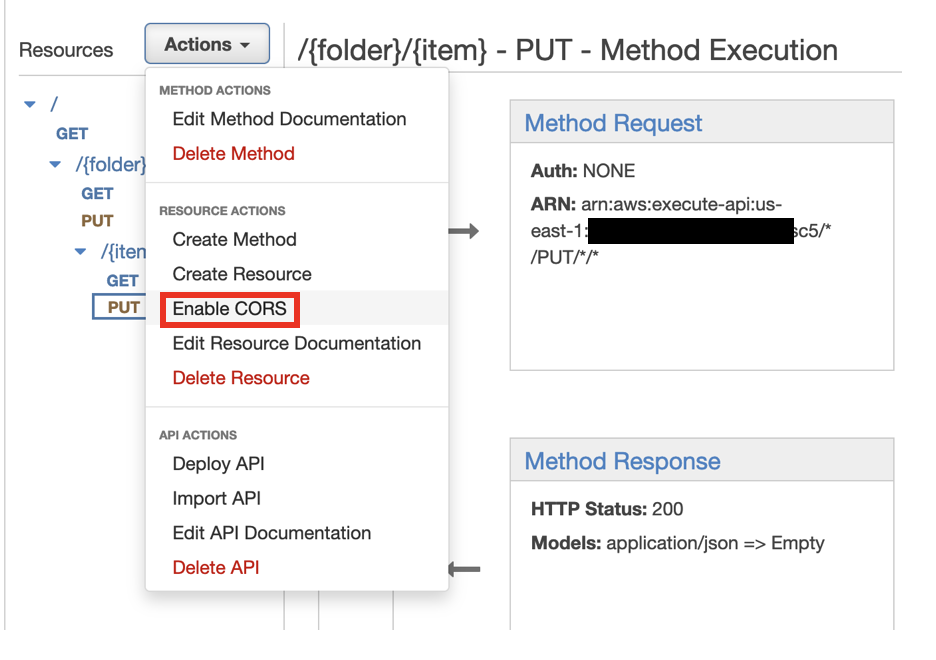

TechEd Watch-and-code CodeJam

# SAP BTP Trial Account Setup - Murali - Diego to pre-populate from OpenSAP & Murali to validate.
## Steps to create BTP Trial Account

# SAP BTP Development Environment Setup - Jorg & Murali
## Option 1: SAP Business Application Studio
Steps to setup Business Appliation Studio 
Check if OpenSAP steps can be used.
## Option 2: Local Visual Studio Code option
### Mac Version

### Windows Version

# SAP CodeJam Exercise
Based on: https://github.com/SAP-samples/cap-service-integration-codejam/tree/main/exercises/12-extend-fiori-ui-with-annotations

## Pre-built content / git repository - Jorg

## Steps to follow - Jorg

# AWS Account Setup - Derek
## Provision AWS Account using Workshop Studio 

# AWS CodeJam 

In this section of the CodeJam you're going to extend the application that you built this morning. 
There are two separated parts for this session.
First, you're going to add the ability to add an attachment to the records you create in the BTP Application. These attachments will be stored in Amazon Simple Storage Services (a.k.a. S3), which is a realiable and cost effective object store service. 
In order to do this, you will create an S3 Bucket (Buckets are object containers), then you will create a Role to provide access to the S3 Bucket and finally an API which will allow you to interact with the S3 bucket from the BTP Application. 

## Part 1 - Attach a document
### Create S3 Bucket

1. Access S3 Console

Enter S3 in the search bar and select S3 from the dropdown menu.


2. Create bucket

On the main S3 console, click on the Crate bucket button on the right


3. Enter bucket name

Enter a bucket name. The bucket name needs to be unique across all AWS accounts. 
A good idea would be to call it <your_name-teched-codejam>.


4. Scroll down and click on Create bucket


5. Access the S3 bucket to retrieve the bucket resource name

This will be required on a subsequent step, when we need to provide authorise our API to access to the S3 Bucket
Click on the bucket name on the list


6. Select Properties


7. Copy the Amazone Resource Name (ARN)

Clicking on the button to the left of the name will copy the ARN.


That's the S3 bucket created. 

### Setup IAM Role

1. Access IAM console

On the search bar, type IAM (Identity Access Management), and select IAM from the menu.


2. Create Policy

Select policies from the left side panel

 
 
Click on the Create policy button
 


Switch the policy editor to JSON clicking on the button 


Copy and paste the following policy in the Policy Editor.
Replace the resource with the ARN you copied before, or just replace the <your_bucket> text with the name of your bucket (without <>). Ensure that the /* are included at the end of the ARN.
This policy enables access to read and write objects from your S3 bucket as well as listing objects within the bucket. 

```
{
    "Version": "2012-10-17",
    "Statement": [
        {
            "Effect": "Allow",
            "Action": [
                "s3:PutObject",
                "s3:GetObject",
                "s3:ListBucket"		
            ],
            "Resource": "arn:aws:s3:::<your_bucket>/*"
        }
}
```


Click next and enter a policy name


Scroll down and click Create policy



You can now search and see your policy.


3. Create Role

Select the Roles menu entry from the side panel


Click Create role


On the next screen, select Custom trust policy. This will enable the role we're creating to be used by our API. The action sts:AssumeRole allows a service or instance to adopt a role while it is performing an action. The service "apigateway.amazonaws.com" specifies that we're allowing the API Gateway service to use this role. 
Copy the following code and paste it on the Custom trust policy section

{
    "Version": "2012-10-17",
    "Statement": [
        {
        "Sid": "",
        "Effect": "Allow",
        "Principal": {
            "Service": "apigateway.amazonaws.com"
        },
        "Action": "sts:AssumeRole"
        }
    ]
} 


Scroll down and click Next


On the next screen, you will add the policy you just created to this role. Search for the policy and select it using the checkbox next to the name. Click Next. 


Enter a name for your role


Scroll down and click Create role


4. Get Amazon Resource Name (ARN) for the role.

This will be required for to create the API. Search for your role and click on the name.


Copy the ARN. You can click on the button on the left to do so. 


### Create API in API Gateway

The next step is to create an API to access the S3 bucket. 
We will enable the option to save and read files from S3.
This is done by implementing the PUT and GET methods.

1. Access API Gateway

Search for API Gateway and click on the service on the menu


1. Put
2. Get

### SAP BTP App Modifications - Shaun
1. Add button to add attachment
Is a popup screen needed?
Add a field on the DB to store attachment details so it can be retrieved. 
3. Call API Put
4. Add button to retrieve attachment
5. Call API Get

## Step 2 - Find a solution using Amazon Bedrock
### API Details - Diego
Check Google API call's limit
Do we need Google?
### Add button in SAP BTP App to call API - Shaun
### Display results in SAP BTP App - Shaun

## Optional Step 3 - Add a notification when a file is attached - Diego
This might be too much. 
