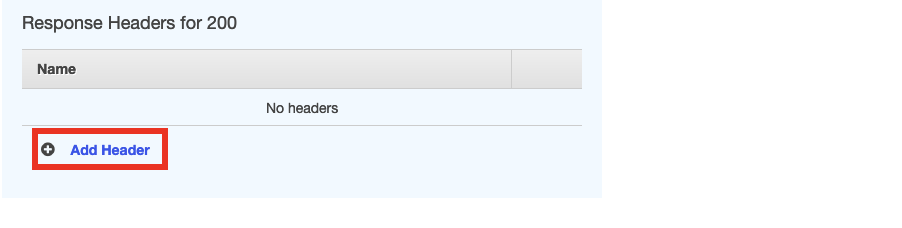
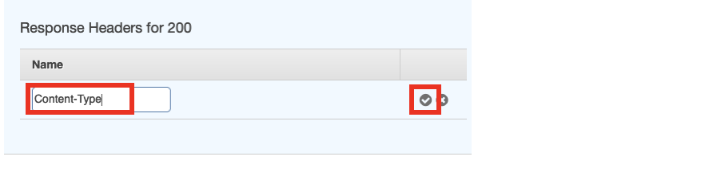

TechEd Watch-and-code CodeJam

# SAP BTP Trial Account Setup
In order to participate in this CodeJam, you will need a BTP account.
If you have an account already, you can use that.
Alternatively you can setup a Trial account following these steps: https://developers.sap.com/tutorials/hcp-create-trial-account.html

# SAP BTP Development Environment Setup - Jorg & Murali
## Option 1: SAP Business Application Studio
Steps to setup Business Appliation Studio 
Check if OpenSAP steps can be used.
## Option 2: Local Visual Studio Code option
### Mac Version

### Windows Version

# SAP CodeJam Exercise
Based on: https://github.com/SAP-samples/cap-service-integration-codejam/tree/main/exercises/12-extend-fiori-ui-with-annotations

## Pre-built content / git repository - Jorg

## Steps to follow - Jorg

# AWS Account Setup - Derek
## Provision AWS Account using Workshop Studio 

# AWS CodeJam 

In this section of the CodeJam you're going to extend the application that you built this morning. 
There are two separated parts for this session.
First, you're going to add the ability to add an attachment to the records you create in the BTP Application. These attachments will be stored in Amazon Simple Storage Services (a.k.a. S3), which is a realiable and cost effective object store service. 
In order to do this, you will create an S3 Bucket (Buckets are object containers), then you will create a Role to provide access to the S3 Bucket and finally an API which will allow you to interact with the S3 bucket from the BTP Application. 

## Part 1 - Attach a document
### Step 1 - Create S3 Bucket

The first step is to create an S3 bucket. There are a number of options available for S3 buckets, including cross region replication, versioning as well as events and notifications. For now you're going to go with a basic setup. 

<details>
1. Access S3 Console

Enter S3 in the search bar and select S3 from the dropdown menu.


2. Create bucket

On the main S3 console, click on the Crate bucket button on the right


3. Enter bucket name

Enter a bucket name. The bucket name needs to be unique across all AWS accounts. 
A good idea would be to call it <your_name-teched-codejam>.


4. Scroll down and click on Create bucket


5. Access the S3 bucket to retrieve the bucket resource name

This will be required on a subsequent step, when we need to provide authorise our API to access to the S3 Bucket
Click on the bucket name on the list


6. Select Properties


7. Copy the Amazone Resource Name (ARN)

Clicking on the button to the left of the name will copy the ARN.


That's the S3 bucket created. 
</details>

### Step 2 - Setup IAM Role

Next you will need to create a policy to provide access to your S3 bucket and assign this to a Role that you will also create. You will use this role later on when creating the API. 


<details>
1. Access IAM console

On the search bar, type IAM (Identity Access Management), and select IAM from the menu.



2. Create Policy

Select policies from the left side panel

 
 
Click on the Create policy button
 


Switch the policy editor to JSON clicking on the button 


Copy and paste the following policy in the Policy Editor.
Replace the resource with the ARN you copied before, or just replace the <your_bucket> text with the name of your bucket (without <>). Ensure that the /* are included at the end of the ARN.
This policy enables access to read and write objects from your S3 bucket as well as listing objects within the bucket. 

```
{
    "Version": "2012-10-17",
    "Statement": [
        {
            "Effect": "Allow",
            "Action": [
                "s3:PutObject",
                "s3:GetObject",
                "s3:ListBucket"		
            ],
            "Resource": "arn:aws:s3:::<your_bucket>/*"
        }
}
```


Click next and enter a policy name


Scroll down and click Create policy


You can now search and see your policy.


3. Create Role

Select the Roles menu entry from the side panel


Click Create role


On the next screen, select Custom trust policy. This will enable the role we're creating to be used by our API. The action sts:AssumeRole allows a service or instance to adopt a role while it is performing an action. The service "apigateway.amazonaws.com" specifies that we're allowing the API Gateway service to use this role. 
Copy the following code and paste it on the Custom trust policy section
```
{
    "Version": "2012-10-17",
    "Statement": [
        {
        "Sid": "",
        "Effect": "Allow",
        "Principal": {
            "Service": "apigateway.amazonaws.com"
        },
        "Action": "sts:AssumeRole"
        }
    ]
} 
```


Scroll down and click Next


On the next screen, you will add the policy you just created to this role. Search for the policy and select it using the checkbox next to the name. Click Next. 


Enter a name for your role


Scroll down and click Create role


4. Get Amazon Resource Name (ARN) for the role.

This will be required for to create the API. Search for your role and click on the name.


Copy the ARN. You can click on the button on the left to do so. 


</details>

### Step 3 - Create API in API Gateway

The next step is to create an API to access the S3 bucket. 
We will enable the option to save and read files from S3.
This is done by implementing the PUT and GET methods.

<details>


1. Access API Gateway

Search for API Gateway and click on the service on the menu


The API Gateway UI is going through a redesign. You're going to use the new console so click on the option at the top within the blue bar or the option on the left panel


2.  Create REST API

On the API Gateway screen, scroll down to REST API


Click Build


Select New API. Enter a name for your API. The endpoint type should be set to Regional. 
Click on Create API


3. Create Resources

The resources will allow us to map the URL call to the S3 Bucket and the file. 
Click on create resource


The first resource will be called {folder}. This will be used in the API URL to indicate the bucket name. 
Tick the CORS checkbox and click Create resource


Create another resource (ensure you have {folder} selected which would be by default after creating it)


This resource you're going to name it {item} and will represent the file name in the API call.
Ensure that /{folder}/ is the preceding resource. 
Tick the CORS checkbox and click Create resource


4. Create GET Method

Now you're going to create the GET method to read the files.
Click on Create method. Emsure you've selected {item} on the resources path on the left. This would be the default after creating the resource


On the next screen, first select GET as the method. This defines the GET method for the API we're creating.
Then click on the AWS Service box. 
Select the region us-east-1 and Simple Storage Service (S3) from the AWS Service from the respective dropdowns. 


 
Scroll down and select the GET method. This select the GET Method from the S3 service. 
Select the Use path override radio button as Action type.
In the Path override field enter {bucket}/{object}. This will define the path to call the S3 API and will allow you to map the resources defined previously.
In the execution role, enter the ARN for the role you created earlier. This allows the API to utilise the policies defined in the role when it is invoked. 
Click on Create method


The next step is to map the url parameters to the Bucket and Object parameters from our S3 bucket.
With the GET method selected on the tree on the left, click on Integration request (any of the two highlighted options)

 

Click Edit


Scroll down


Expand the URL path parameters and click add path parameter 


Add the two parameters as per the mapping below. This maps the folder and item (file) from the URL to the S3 bucket and object names.

    ```
    Name: bucket - Mapped from: method.request.path.folder 
    Name: object – Mapped from: method.request.path.item
    ```

Click Save


5. Create PUT Method

Next you will create the PUT method. The steps are the same as with the GET method, with the exception of selecting PUT instead of GET.
First click on {item} so you're on the right place and the Create method button will display on the right panel.


Click in Create method


Select the PUT method.
As before, select AWS Service, us-east-1 and Simple Storage Service (S3)


Scroll down and select the PUT method. 
Select Use path override, enter {bucket}/{object} and the ARN from your role.
Click Create method once you're done.


Next select Integration request from any of the two options.


Click Edit


Scroll down


Expand URL path paremeters and add the two parameters, same as with the GET Method. 


 ```
    Name: bucket - Mapped from: method.request.path.folder 
    Name: object – Mapped from: method.request.path.item
```

Click Save


6. Enable Binary media types

By default, binary media types are not permitted. 
In this case, you're going to enable PDF files. 
Click on API Settings on the left panel


Click on Manage media types


Click on Add binary media type


Enter application/pdf and click Save changes


7. Deploy API

Click on Resources on the left side panel


Click on the Deploy API button


Next you have to select a Stage. A stage allows you to have different versions of an API. This is commonly used to differentiate versions.


Since it is the first time you're deploying, you have to create a stage. Select New Stage from the dropdown


Enter a name (i.e.: v1). This will be used in the API URL.
Click on Deploy.


The API is now ready to be used. You can see the URL in the Invoke URL field


</details>

### SAP BTP App Modifications - Shaun
1. Add button to add attachment
Is a popup screen needed?
Add a field on the DB to store attachment details so it can be retrieved. 
3. Call API Put
4. Add button to retrieve attachment
5. Call API Get

## Part 2 - Find a solution using Amazon Bedrock

In the second step you're going to call a pre-defined API to find a solution for the incidents you create in your BTP application.
The API provided below will receive a question (in the body of the call) and will first perform an internet search for a solution and provide a step by step set of instructions for you to solve your problem. This API leverages the Generative AI capability provided by Amazon Bedrock and the Anthropic Claude Foundation Model. 

### API Details:

https://w2n1b8qko7.execute-api.us-east-1.amazonaws.com/v1/fix

### Body:

{
	"Question" : "<TITLE OF THE INCIDENT FROM BTP>"
}


### Add button in SAP BTP App to call API - Shaun


### Display results in SAP BTP App - Shaun

